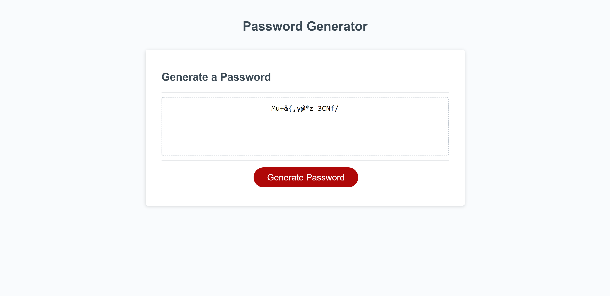

# password-generator

## Description

**Goal:** To create a random password generator that is customizable by users.

User security has been an issue on the internet for most of its existence. When users use simpler passwords that are easy to remember for online accounts, they run the risk of letting hackers log in to those accounts and gather confidential information, lock them out, etc.

To combat this, we can use randomly generated passwords. Randomly generated passwords are impossible to crack, and would take millions of years to decode in some cases. The more types of characters included and the longer the password, the longer it will take to uncover exponentially.

## Development

1. Created arrays to hold each type of character.
1. Gathered user preferences with a series of prompts and confirmations. Validated user input.
1. Collected chosen characters into array.
1. Randomly selected characters and placed into new array using for loop.
1. Joined characters and returned new password.
1. Password appears on page.

## Deployment

[Deployed Webpage](https://supsha878.github.io/password-generator/)